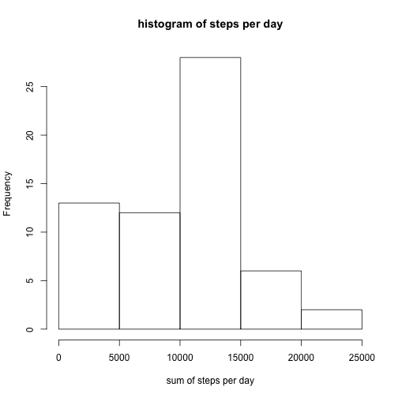
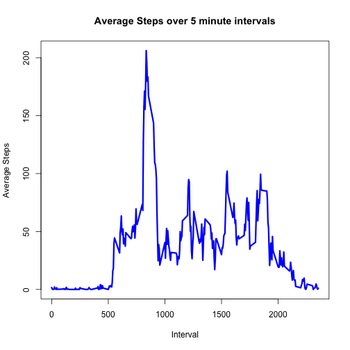
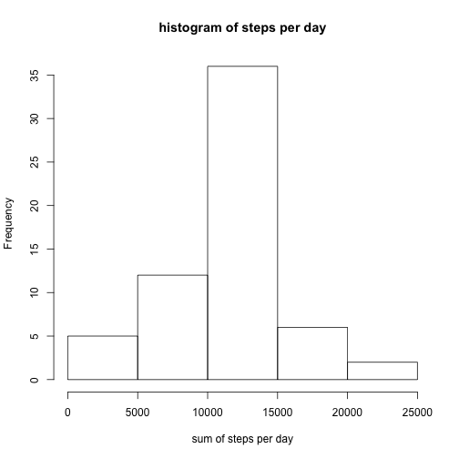
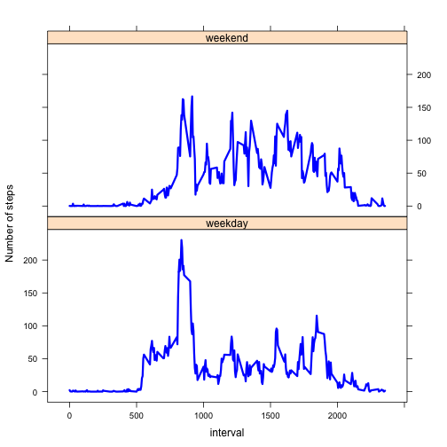

##Reproducible Research Course Project 1


###Introduction
This assignment makes use of data from a personal activity monitoring device. This device collects data at 5 minute intervals through out the day. The data consists of two months of data from an anonymous individual collected during the months of October and November, 2012 and include the number of steps taken in 5 minute intervals each day.

###Loading and Preprocessing the data

```r
activity <- read.csv("activity.csv", header = TRUE, sep = ",")
```

###What is mean total number of steps taken per day?
1.Make a histogram of the total number of steps taken each day  
2.Calculate and report the mean and median total number of steps taken per day

```r
sum <- tapply(activity$steps, activity$date, sum, na.rm=TRUE)
hist(sum, xlab = "sum of steps per day", main = "histogram of steps per day")
```



```r
mean<-round(mean(sum))
median<-round(median(sum))
print(c("The mean is",mean))
```

```
## [1] "The mean is" "9354"
```

```r
print(c("The median is",median))
```

```
## [1] "The median is" "10395"
```

###What is the average daily activity pattern?
1.Make a time series plot (i.e. type = "l") of the 5-minute interval (x-axis) and the average number of steps taken, averaged across all days (y-axis)  
2.Which 5-minute interval, on average across all the days in the dataset, contains the maximum number of steps?

```r
mean_interval <- tapply(activity$steps, activity$interval, mean, na.rm=TRUE)
plot(mean_interval ~ unique(activity$interval), type="l", xlab = "Interval",ylab="Average Steps",main="Average Steps over 5 minute intervals",col="blue",lwd=3)
```



```r
mean_interval[which.max(mean_interval)]
```

```
##      835 
## 206.1698
```

```r
print("The interval with the highest average is 835th inverval with 206 steps")
```

```
## [1] "The interval with the highest average is 835th inverval with 206 steps"
```

###Imputing missing values
1.Calculate and report the total number of missing values in the dataset (i.e. the total number of rows with NAs)  
2.Devise a strategy for filling in all of the missing values in the dataset. The strategy does not need to be sophisticated. For example, you could use the mean/median for that day, or the mean for that 5-minute interval, etc.  
3.Create a new dataset that is equal to the original dataset but with the missing data filled in.  
4.Make a histogram of the total number of steps taken each day and Calculate and report the mean and median total number of steps taken per day. Do these values differ from the estimates from the first part of the assignment? What is the impact of imputing missing data on the estimates of the total daily number of steps?  

#####Total number of missing values

```r
summary(activity)
```

```
##      steps                date          interval     
##  Min.   :  0.00   2012-10-01:  288   Min.   :   0.0  
##  1st Qu.:  0.00   2012-10-02:  288   1st Qu.: 588.8  
##  Median :  0.00   2012-10-03:  288   Median :1177.5  
##  Mean   : 37.38   2012-10-04:  288   Mean   :1177.5  
##  3rd Qu.: 12.00   2012-10-05:  288   3rd Qu.:1766.2  
##  Max.   :806.00   2012-10-06:  288   Max.   :2355.0  
##  NA's   :2304     (Other)   :15840
```

```r
missing<- sum(is.na(activity$steps))
print(c("The total number of missing values is ",missing))
```

```
## [1] "The total number of missing values is "
## [2] "2304"
```

#####Filling in the missing values in the new dataset and Making a Histogram

```r
activity2 <- activity 
for (i in 1:nrow(activity)){
    if(is.na(activity$steps[i])){
        activity2$steps[i]<- mean_interval[[as.character(activity[i, "interval"])]]
    }
}

sum2 <- tapply(activity2$steps, activity2$date, sum, na.rm=TRUE)
hist(sum2, xlab = "sum of steps per day", main = "histogram of steps per day")
```



#####Mean and Median of new dataset and difference compared to original data

```r
mean2<-round(mean(sum2))
median2<-round(median(sum2))
print(c("The new mean is",mean2))
```

```
## [1] "The new mean is" "10766"
```

```r
print(c("The new median is",median2))
```

```
## [1] "The new median is" "10766"
```

```r
compare<-NULL
compare <- rbind(compare, data.frame(mean = c(mean, mean2), median = c(median, median2)))
rownames(compare) <- c("with NA's", "without NA's")
print(compare)
```

```
##               mean median
## with NA's     9354  10395
## without NA's 10766  10766
```

###Are there differences in activity patterns between weekdays and weekends?
1.Create a new factor variable in the dataset with two levels -- "weekday" and "weekend" indicating whether a given date is a weekday or weekend day.  
2.Make a panel plot containing a time series plot (i.e. type = "l") of the 5-minute interval (x-axis) and the average number of steps taken, averaged across all weekday days or weekend days (y-axis).  


```r
activity2$weekday <- c("weekday")
activity2[weekdays(as.Date(activity2[, 2])) %in% c("Saturday", "Sunday", "samedi", "dimanche", "saturday", "sunday", "Samedi", "Dimanche"), ][4] <- c("weekend")
table(activity2$weekday == "weekend")
```

```
## 
## FALSE  TRUE 
## 12960  4608
```

```r
activity2$weekday <- factor(activity2$weekday)
activity2_weekend <- subset(activity2, activity2$weekday == "weekend")
activity2_weekday <- subset(activity2, activity2$weekday == "weekday")
mean_activity2_weekday <- tapply(activity2_weekday$steps, activity2_weekday$interval, mean)
mean_activity2_weekend <- tapply(activity2_weekend$steps, activity2_weekend$interval, mean)
```


```r
library(lattice)
df_weekday <- data.frame(interval = unique(activity2_weekday$interval), avg = as.numeric(mean_activity2_weekday), day = rep("weekday", length(mean_activity2_weekday)))
df_weekend <- data.frame(interval = unique(activity2_weekend$interval), avg = as.numeric(mean_activity2_weekend), day = rep("weekend", length(mean_activity2_weekend)))
df_final <- rbind(df_weekday, df_weekend)
xyplot(avg ~ interval | day, data = df_final, layout = c(1, 2), 
       type = "l", ylab = "Number of steps",col="blue",lwd=3)
```



